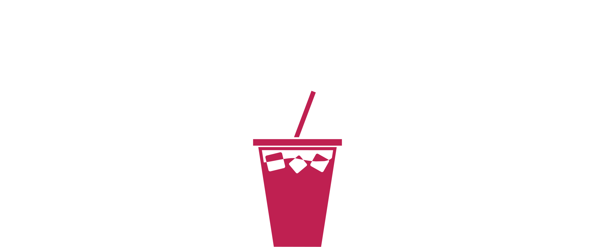

<a name="readme-top"></a>


<!-- PROJECT LOGO -->
<br />
<div align="center">
  <a href="">
    
  </a>


  <p align="center">
    <br />
    <a href="./docs/">Explore the docs</a>
    ·
    <a href="https://youtu.be/J_wFOuJC4kM">View Demo</a>
  </p>
</div>


<!-- TABLE OF CONTENTS -->
<details>
  <summary>Table of Contents</summary>
  <ol>
    <li>
      <a href="#about-the-project">About The Project</a>
      <ul>
        <li><a href="#built-with">Built With</a></li>
      </ul>
    </li>
    <li>
      <a href="#getting-started">Getting Started</a>
      <ul>
        <li><a href="#prerequisites">Prerequisites</a></li>
        <li><a href="#building-and-running">Building and Running</a></li>
      </ul>
    </li>
  </ol>
</details>


<!-- ABOUT THE PROJECT -->
## About The Project

The objective of this project is to build an autonomous robot capable of crafting a diverse range of cocktails.

With this application, users can request for the desired cocktail and the robot will be responsible for finding the necessary ingredients and moving back to the bar counter. However, it is important to note that the scope of this project does not include grasping the ingredients only moving towards their position. 

<p align="right">(<a href="#readme-top">back to top</a>)</p>

### Built With

List of major frameworks/libraries used to build and maintain the application.

For more details, please refer to the project's [Architecture and Design](./docs/architecture_design.md).


* [![ROS][ROS]][ROS-url]


<p align="right">(<a href="#readme-top">back to top</a>)</p>


<!-- GETTING STARTED -->
## Getting Started

To get a local copy up and running follow these simple steps.

### Prerequisites

1. ROS (distro Noetic)

#### Install Pre-required Python Packages

```bash
pip install -r ./src/cocktail_bot/requirements.txt
```

### Building and Running

1. Build the project:
```bash
./src/cocktail_bot/scripts/build.sh
```

2. Run simulation environment (Gazebo and Rviz):
```bash
./src/cocktail_bot/scripts/gazebo.sh
```

3. Run all nodes:
```bash
./src/cocktail_bot/scripts/all_nodes.sh
```

4. Make cocktail requests:
```bash
# The default cocktail is `margarita`.
# In order to change request, the script file must be edited.
./src/cocktail_bot/scripts/make_cocktail.sh
```

<p align="right">(<a href="#readme-top">back to top</a>)</p>


<!-- ACKNOWLEDGEMENTS -->
## Acknowledgements

Helpful resources:

* [README Template](https://github.com/othneildrew/Best-README-Template)

Contributors:
- André Pereira
- João Marinho
- Maria Teles

<p align="right">(<a href="#readme-top">back to top</a>)</p>


<!-- MARKDOWN LINKS & IMAGES -->
<!-- https://www.markdownguide.org/basic-syntax/#reference-style-links -->
[ROS]: https://img.shields.io/badge/ros-%230A0FF9.svg?style=for-the-badge&logo=ros&logoColor=white
[ROS-url]: http://wiki.ros.org/noetic
