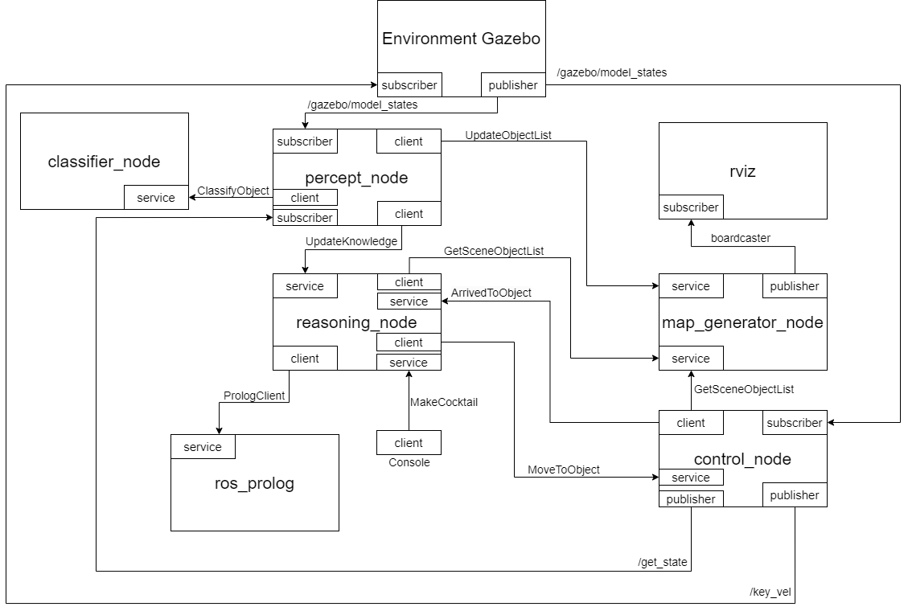

# Architecture and Design

In our autonomous robot project, we have adopted a modular architecture inspired by the principles of decentralization. Our robot's design divides functionalities into distinct nodes or modules, each encapsulating specific tasks, such as perception, decision-making, motion control, and others.

The following diagram illustrates the high-level structure of the project and the communication between its different components:

## Perception

Collects information from the environment.

**Communication:**
- Gazebo Subscriber: Gather knowledge about the nearby objects.
- Classifier Client: Object classification.
- Update Object List Client: Update object instance mapping.
- Update Knowledge Client: Update knowledge base instances.
- Controller Subscriber: Get current robot state.

## Classification

Identify the type of object.

**Communication:**
- Classifier Service: Classifies objects based on their characteristics.

## Reasoning

Fulfills the cocktail request by telling the robot where to go.

**Communication:**
- Cocktail Service: Responsible to process the cocktail request.
- Update Knowledge Service: Receives instances to update knowledge base.
- Prolog Client: Interacts with prolog knowledge base.
- Move to Object Client: Informs the controller which object to move to.
- Arrived to Object Service: Know when the robot has arrived to the target.
- Get Object Client: Requests information (pose) about a certain object.

## Mapping

Stores information about the object position.

**Communication:**
- Rviz Publisher: Broadcast object position to rviz node.
- Get Object Service: Provides the requested object(s) poses.
- Update Object List Service: Updates the map with the new object and respective pose.

## Control

Commands the robot to reach its destinations.

**Communication:**
- Move to Object Service: Handles movement requests to the robot.
- Get Object Client: Requests information about the object pose.
- Gazebo Subscriber: Receives information about the current robot pose.
- Controls Publisher: Publishes movement controls to the robot.
- State Publisher: Publishes the current robot state.
